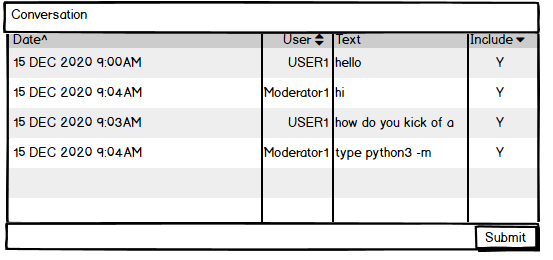

<h1 align="center">Chat with Conversation Annotator for Chatbot</h1>

[View the live project here.](https://codeinstitute.net)

This is a chat application inteface with conversation data annotation feature. It is designed to capture actual conversations via the chatbot with annotation to improve accuracy and quality of the bot conversations.
Data annotators will have access to annotate chat conversations for the purpose of traning AI chatbot for greater accuracy of Chatbot conversations

<h2 align="center"></h2>

## Operational Features

A chat application with conversation data prep to feed into an AI model (not included in the scope)

- Build a real time chat application (chat room if not too complex) for one on one conversations
- Using Flask and python to processs conversations and store in MongoDB
- MongoDB schema will support conversations to be classified and rated and also edited
- A form interface for data analyst to annotate, classify the captured
- Flask.socketIO to support realtime conversations
- Use Materialize to build the chat UX....need suggestion where to find chat app UX templates/components
- Chat Application will included chat application user account creation, user rating for conversations, user role and access administratio
- API for JASON extract for external AI modelling use


## Strategy Plane

The primary goal of the application is to capture and anotate actual conversations for training AI conversational models for chatbots.
Conversation domain is specific to an organization who utilizes chatbot to perform a specific task.

The user will be able to get informaton for a specifc product or service.
The business will be able to provide accurate and relevant information to the customer with high rating.

Generic AI models for chatbot conversations does not capture to specific context of a business and profile of target customers.
There is a need for explainable AI models

Usable data to train AI models for specific contexts that is specific to a domain and fine tune to a specific business use case is likely to yield the best results.

The focus of the project is on data
[Python Chat Bot Tutorial - Chatbot with Deep Learning (Part 1)](https://www.youtube.com/watch?v=wypVcNIH6D4https://www.youtube.com/watch?v=wypVcNIH6D4)

## User Experience (UX)

### User stories

#### User Chat Session

    1. As a User, I want to be able to select a topic for a conversation to speak with an expert
    2. As a User, I want to be able to be able to have a conversation real timeadn not have to wait
    3. As a User, I want to be able to review the entire conversation during the session
    4. As a User, I want to be able to be able to rate the conversation to provide feedback on wheter it was satisfactory
    5. As a User, I want to be able to register as a user for the application to participate in a conversation
    6. As a User, I want to be notified of a Moderator is online and available for a conversation
    7. As a User, I want to be able to rate the conversation to provide feedback

#### Topic Moderator

    1. As a Moderator, I want to be able to respond to questions from user in real time to assist user
    2. As a Moderator, I want to be able to conduct one conversation session one at a time
    3. As a Moderator, I want to be able to be able to terminate a conversaton session to indeicate completion of conversation session

#### Chat Conversation Annotator

##### Review and Update Conversations
    1. As an Annotator, I want to be able to review and annotate conversation to be used for traning AI bot
    2. As an Annotator, I want to be able to rate the quality of the conversation to confirm if it aligns with  user rating
    3. As an Annotator, I want to be able to reclassify the conversation to the correct topic for traning Ai Bot
    4. As an Annotator, I want to be able to identify a new topic to the list of topics 
    5. As an Annotator, I want to check to see if there are any new conversations that need annotation
    6. As an Annotator, I want to modify the conversation to deliver an accurate respons to questions
    
##### Manage Topic Tags

    1. As an Annotator, I want to add new topic tags to categorize conversations
    2. As an Annotator, I want to update topic tags to 
       Note: topic tags cannot be deleted when used or cascade changes to conversation messages
    3. As an Annotator, I want to be able filter cascading topic changes to conversation messages tht have been tagged 

#### Chat Application Administrator

    1. As an Administratar, I can delete any conversation if requested by the user to comply to GDPR regulations
    2. As an Administrator, I can deactivate any user to revoke access to the application
    3. As an Administrator, I can assign roles to a user
    
#### Navigation Routes

##### Chat Welcome (@welcome)

##### Chat Dashboard(@dashboard)

##### Chat Panel (@session/user)

##### Chat Panel (@session/moderator)

##### Annotate Chat Conversation (@chatannotate)

##### Application Administrator (@chatAdmin)

### Wireframes

#### Mobile

##### Welcome Page - [View](https://github.com/)


##### Mobile Chat Dashboard


##### Mobile Chat Widget


##### Mobile Rating Conversation


##### Mobile Chat Admin


##### Mobile Annotate Conversations



![pythonGrid][assets/images/pythonGrid.png]
Soruce: [PythonGRid](https://pythongrid.com/)

##### Mobile Application Administration


Soruce: [PythonGRid](https://pythongrid.com/)

#### 

##### 404 Not Found Page


Soruce: [Python Flask Tutorial: Full-Featured Web App Part 12 - Custom Error Pages]https://www.youtube.com/watch?v=uVNfQDohYNI
https://flask.palletsprojects.com/en/1.1.x/patterns/errorpages/

##### 403 Do Not Have Permission


##### 500 Internal Server

![500] Page](assets/images/403Page.png)

#### Computers and Tablets Pages

##### Chat Welcome Page


##### Chat Dashboard


##### Chat Panel


##### Data Processing and Annotate Conversations

![pythonGrid][assets/images/pythonGrid.png]
Soruce: [PythonGRid](https://pythongrid.com/)

##### Application Administration


Soruce: [PythonGRid'(https://pythongrid.com/)

##### Code Values Maintenance
- Category
- Rating

#### Support pages

##### 404 Not Found Page


##### Contact Us Page Wireframe

[Contact Us] (assets/images/contactUs.png)

Soruce:
[25 Best Contact Us Page Examples to Inspire Yours (Updated for 2020)](https://www.impactplus.com/blog/best-contact-us-page-examples)


## Features

### Ideal device size greater than 600px

### Responsive on all device sizes

### Realtime Interactive Chat form

- Real time

Soruce: 

- [MAKE YOUR OWN CHAT ARENA,using flask, socket io in 7 minute](https://www.linkedin.com/pulse/make-your-own-chat-arenausing-flask-socket-io-7-minutes-suraj-/)
- [https://www.linkedin.com/pulse/make-your-own-chat-arenausing-flask-socket-io-7-minutes-suraj-/](https://codeburst.io/building-your-first-chat-application-using-flask-in-7-minutes-f98de4adfa5d)


### Interactive Workbench for Conversation Annotation

### Application Adminstration
  - User Role
  - CRUD converstations
  - Code maintenance

### MONGODB Conversation database

### Defensive and Progress Bars

### Advance Features

#### CRUD APIs

Source:
- [Launch your own REST API using Flask & Python in 7 minutes.](https://morioh.com/p/8a7d070e6e96)

- [Launch your own REST API using Flask & Python in 7 minutes](https://towardsdatascience.com/launch-your-own-rest-api-using-flask-python-in-7-minutes-c4373eb34239)

#### REST API for loading training conversations

API for JASON extract

```
{intents:[
  {"tag": "greeting",
    "pattern": []
    "response": []
    "context_set: :"
    },
  {"tag": "goodbye",
    "pattern": []
    "response": []
    "context_set: :"
    },
],
}
```

#### WEB Scraping

#### Security Features

## Database schema for chatbot conversation

```
IMPORTANT

In most cases, multi-document transaction incurs a greater performance cost over single document writes, 
and the availability of multi-document transactions should not be a replacement for effective schema design. 
For many scenarios, the denormalized data model (embedded documents and arrays) will continue to be optimal 
for your data and use cases. That is, for many scenarios, modeling your data appropriately will minimize 
the need for multi-document transactions.

Reference: [Operational Factors and Data Models](https://docs.mongodb.com/manual/core/data-model-operations/)

```

### Conversation

```
{conversation:{
    _id:,
    user:"user_id"
    tag:"123xyz",
    rating: rating,
    annotated_status: "Pending, Completed"
    othertopic: <user enterd topic>
    [
        {
         timestamp:
         conversation text:"How are you?"
         exclude:
        },
        {
         timestamp:
        "I am good.",
         exclude:
        {
         timestamp:
        "That is good to hear.",
         exclude:
        },
        {
         timestamp:
        "Thank you",
         exclude:
        },
        {
         timestamp:
        "You are welcome.",
         exclude:
        }
    ]
}
```

### Conversation Topic Tags

Customize for Specific task: 
Answer Gitpod how to questions based on conversations in slack
 - GitpodCreateWorkspace
 - GitPodTerminal
 - GitPodhttpServer
 - GitPodclearcache

```
{topic:
    {
    _id:,
    topic:"Create Workspace"
    category:
    },
    {
    _id:,
    topic:"Terminal"
    category:
    },  
    {
    _id:,
    topic:"ClearCache"
    category:
    }
}
```

### User profile

Access Status: Active, Inactive

```
{user:
[
    _id:
    "username",
    "password",  encrypted
    "roletype" 
    "accessstatus"
]
}
```

### User Roles

Role Types : user,moderator, admin, annotator

```
{role:
    [
    _id:
     roletype: 
    ]
}
```

### Rating

```
Rating: 
    {
        _id,
        Rate: 1
        Rate Meaning: "Totally Satisfied"   
    },
    {
        _id,
        Rate: 2
        Rate Meaning: "Satisfactory"   
    },
    {
        _id,
        Rate: 3
        Rate Meaning: "Dissatisfied"   
    },
    {
        _id,
        Rate: 4
        Rate Meaning: "Totally Dissatisfied"   
    },

}
```

### Guest Contact

```
Guest: 
    {
        _id,
        First Name:
        Last name
        email: 1
        Request message:
    }
```

## CRUD Functions

Soruces:
- [Create a CRUD Restful Service API using Flask + Mysql in 7 minutes!](https://www.nintyzeros.com/2019/11/flask-mysql-crud-restful-api.html)

### CREATE

- Conversation 

### READ

Update conversatios to render the best responses by topic

- UPDATE Conversations
- Rank Conversations
- DELETE
  Remove poor conversations

  [Building Datagrid for CRUD in Flask with pythonGrid](https://www.codementor.io/@pycr/building-datagrid-for-crud-in-flask-in-pythongrid-16oltg7lr8)
  [PyMongo](https://pymongo.readthedocs.io/en/stable/tutorial.htmlhttps://pymongo.readthedocs.io/en/stable/tutorial.html)
  Annotate conversation
  Rank responses and conversation

## Components

### HTML based User interfaces

### Templates

#### Welcome Start
- Animated Chatbot
- Start button
- Redirect login

#### Login

- Login Form
- Submit button
- Validate emal
- Flash message
- Create Account button or Link
    - redirect create Account
- Redirect dashboard

#### Create Account

- Create account Form
- Submit button
- Redirect topic dashboard

#### Topic dashboard

- Select topic list
- Other topic
- Consider topic user input function
- Redirect Chat session

#### Chat session for User and Responder

- Display session Conversation
- Flask Socket IO insted of long polling
- Session Info: user, random variable, variables
- Enter Message
- End conversation
- End conversation button trigger User Rating Fom(Optional user input)
- Redirect Rating

#### Conversation rating

- Rating form
- Submit button
- Done
- Redirect login


#### Data Annotation

- Search by Conversation attributes, topic, rating and Status
- Display Conversation
- Update Conversations Attributes
- Update/exclude conversation Details (python grid?)
- Save button
    - Flash work not save
- Done button
- Redirect login

#### Additional templates

##### Update User Profile

## Routes

## Code components

### Session

### Client

#### Client Fuctions

### Server

#### Server Functions

### Routes

## Events


### Design

  - #### Colour Scheme
    - BLue whit and black
  - #### Typography
    - The Montserrat font is the main font used throughout the whole website with Sans Serif as the fallback font in case for any reason the font isn't being imported into the site correctly. Montserrat is a clean font used frequently in programming, so it is both attractive and appropriate.
  - #### Imagery
    - gifs that catch atttension

## Technologies Used

### Languages Used

- [HTML5](https://en.wikipedia.org/wiki/HTML5)
- [CSS3](https://en.wikipedia.org/wiki/Cascading_Style_Sheets)

### Frameworks, Libraries & Programs Used

[flask-SocketIO](https://flask-socketio.readthedocs.io/en/latest/)

[flask-login](https://www.youtube.com/redirect?q=https%3A%2F%2Fflask-login.readthedocs.io%2Fen%2Flatest%2F&v=rrIdQJSKiP4&redir_token=QUFFLUhqbFVhQnc0aHRJN1hodnVQTnVtRWR0dUJFd0pRQXxBQ3Jtc0ttY2xBQWZabHRGbndCM3FDcUwtSXNWVWVEMUgwRUNHb0pVX2lCVkNCc2lqMG40MWF3ZWdibzdkU192UWJKQThUdlplNTJCeVhnbW1ueDJ6bFpBaF92Rm02OElYLVFhWHN2WGtqalVBWFNSS0ZDRm5Zaw%3D%3D&event=video_description)


1. [Materialize](https://materializecss.com/about.html)
   - Google's goal is to develop a system of design that allows for a unified user experience across all their products on any platform.
1. [Hover.css:](https://ianlunn.github.io/Hover/)
   - Hover.css was used on the Social Media icons in the footer to add the float transition while being hovered over.
1. [Google Fonts:](https://fonts.google.com/)
   - Google fonts were used to import the 'Titillium Web' font into the style.css file which is used on all pages throughout the project.
1. [Font Awesome:](https://fontawesome.com/)
   - Font Awesome was used on all pages throughout the website to add icons for aesthetic and UX purposes.
1. [javascript:](https://developer.mozilla.org/en-US/docs/Web/JavaScript)
   - javascrpt event listener and DOM manipulation
1. [Git](https://git-scm.com/)
   - Git was used for version control by utilizing the Gitpod terminal to commit to Git and Push to GitHub.
1. [GitHub:](https://github.com/)
   - GitHub is used to store the projects code after being pushed from Git.
1. [Photoshop:](https://www.adobe.com/ie/products/photoshop.html)
   - Photoshop was used to create the logo, resizing images and editing photos for the website.
1. [Balsamiq:](https://balsamiq.com/)
   - Balsamiq was used to create the [wireframes](https://github.com/) during the design process.

## Testing

The W3C Markup Validator and W3C CSS Validator Services were used to validate every page of the project to ensure there were no syntax errors in the project.

- [W3C Markup Validator](https://jigsaw.w3.org/css-validator/#validate_by_input) - [Results](https://github.com/)
- [W3C CSS Validator](https://jigsaw.w3.org/css-validator/#validate_by_input) - [Results](https://github.com/)

### Testing User Stories from User Experience (UX) Section

- #### First Time Visitor Goals

- #### Returning Visitor Goals

- #### Frequent User Goals

### Further Testing


### Known Bugs

## Deployment

### Heroku

### Forking the GitHub Repository

By forking the GitHub Repository we make a copy of the original repository on our GitHub account to view and/or make changes without affecting the original repository by using the following steps...

1. Log in to GitHub and locate the [GitHub Repository](https://github.com/)
2. At the top of the Repository (not top of page) just above the "Settings" Button on the menu, locate the "Fork" Button.
3. You should now have a copy of the original repository in your GitHub account.

### Making a Local Clone

1. Log in to GitHub and locate the [GitHub Repository](https://github.com/)
2. Under the repository name, click "Clone or download".
3. To clone the repository using HTTPS, under "Clone with HTTPS", copy the link.
4. Open Git Bash
5. Change the current working directory to the location where you want the cloned directory to be made.
6. Type `git clone`, and then paste the URL you copied in Step 3.

```
$ git clone https://github.com/YOUR-USERNAME/YOUR-REPOSITORY
```

7. Press Enter. Your local clone will be created.

```
$ git clone https://github.com/YOUR-USERNAME/YOUR-REPOSITORY
> Cloning into `CI-Clone`...
> remote: Counting objects: 10, done.
> remote: Compressing objects: 100% (8/8), done.
> remove: Total 10 (delta 1), reused 10 (delta 1)
> Unpacking objects: 100% (10/10), done.
```

Click [Here](https://help.github.com/en/github/creating-cloning-and-archiving-repositories/cloning-a-repository#cloning-a-repository-to-github-desktop) to retrieve pictures for some of the buttons and more detailed explanations of the above process.

## Credits

### Code

- [MDN Web Docs](https://developer.mozilla.org/) : For Pattern Validation code. Code was modified to better fit my needs and to match an Irish phone number layout to ensure correct validation. Tutorial Found [Here](https://developer.mozilla.org/en-US/docs/Web/HTML/Element/input/tel#Pattern_validation)

### References

- [ChatterBot] (https://chatterbot.readthedocs.io/en/stable/)

- [The MongoDB 4.2 Manual](https://docs.mongodb.com/v4.2/)

- [Let’s Build an Intelligent Chatbot](https://www.kdnuggets.com/2019/12/build-intelligent-chatbot.html)

#### Tutorials

- [Build a Simple CRUD App with Python, Flask, and React](https://developer.okta.com/blog/2018/12/20/crud-app-with-python-flask-react)
- [Node.js: Real-Time Web with Socket.IO](https://www.lynda.com/Node-js-tutorials/Course-prerequisites/633868/685558-4.html?srchtrk=index%3a14%0alinktypeid%3a2%0aq%3aflask_socketio%0apage%3a1%0as%3arelevance%0asa%3atrue%0aproducttypeid%3a2)
- [Building your first Chat Application using Flask in 7 minutes](https://codeburst.io/building-your-first-chat-application-using-flask-in-7-minutes-f98de4adfa5d)
- [Simple boilerplate for ChatterBot using Flask](https://xscode.com/chamkank/flask-chatterbot)
- [Python Chat Bot Tutorial - Chatbot with Deep Learning (Part 1)](https://www.youtube.com/watch?v=wypVcNIH6D4https://www.youtube.com/watch?v=wypVcNIH6D4)
- [Livechat Bot Transfer users from a bot to a live agent](https://www.appypie.com/chatbot/livechat-bot)
- [Creating a Discord Bot from Scratch and Connecting to MongoDB](https://towardsdatascience.com/creating-a-discord-bot-from-scratch-and-connecting-to-mongodb-828ad1c7c22e)
- [How To Make A Chatbot In Python?](https://www.edureka.co/blog/how-to-make-a-chatbot-in-python/)
- [1.1: fetch() - Working With Data & APIs in JavaScript](https://www.youtube.com/watch?v=tc8DU14qX6I&feature=youtu.be)
- [How to use Fetch with JavaScript](https://www.youtube.com/watch?v=tVQgfKqbX3M&feature=youtu.be)
- [JavaScript this Keyword Explained In 3 Minutes](https://www.youtube.com/watch?v=Pi3QC_fVaD0)
- [JavaScript Promise in 100 Seconds](https://www.youtube.com/watch?v=RvYYCGs45L4)
- [Intro To JavaScript Unit Testing & BDD (2 Hour+ Course)](https://www.youtube.com/watch?v=u5cLK1UrFyQ&feature=youtu.be)

- [Awesome Python Awesome A curated list of awesome Python frameworks, libraries, software and resources.](https://awesome-python.com/)

#### Database schema
- [Data Model Design](https://docs.mongodb.com/manual/core/data-model-design/)
- [Operational Factors and Data Models](https://docs.mongodb.com/manual/core/data-model-operations/)
- [Model Data for Atomic Operations Pattern](https://docs.mongodb.com/manual/tutorial/model-data-for-atomic-operations/#data-modeling-atomic-operation)
- [MongoEngine](http://docs.mongoengine.org/tutorial.html)

#### MONGODB CRUD
- [Transactions and Operations](https://docs.mongodb.com/manual/core/transactions-operations/#transactions-operations-crud)
- [Query an Array](https://docs.mongodb.com/manual/tutorial/query-arrays/#read-operations-arrays)
- [Query on Embedded/Nested Documents](https://docs.mongodb.com/manual/tutorial/query-embedded-documents/#read-operations-embedded-documents)
- [Model Data to Support Keyword Search](https://docs.mongodb.com/manual/tutorial/model-data-for-keyword-search/)

#### SocketIO
- [Create Chat Applicaton Using Flask-SocketIO - Chat App Part12](https://www.youtube.com/watch?v=zQDzNNt6xd4)
- [Node.js:Real-Time Web Socket.IO](https://www.lynda.com/Node-js-tutorials/Node-js-Real-Time-Web-Socket-IO/633868-2.html)


#### Documentation

- [Demo your App in your GitHub README with an Animated GIF](https://dev.to/kelli/demo-your-app-in-your-github-readme-with-an-animated-gif-2o3c)

- [How to use JSDoc - Basics & Introduction](https://www.youtube.com/watch?v=Nqv6UkTROak)
- [Code Institue Sample ReadMe](https://github.com/Code-Institute-Solutions/SampleREADME)

#### UX

- [Chatbot Design](https://dribbble.com/tags/chatbot?page=19&s=latest)
- [8 beautiful chatbot UI examples that will definitely inspire you](https://www.digital22.com/insights/beautiful-chatbot-ui-examples-that-will-definitely-inspire-you#a6)

##### UX Sources Credits
  - [Chat UI Welcome Screen from Vlad Tyzum][https://www.digital22.com/insights/beautiful-chatbot-ui-examples-that-will-definitely-inspire-you#a6]
  - [Dashboard and Chat](https://dribbble.com/shots/10978875-Insurance-app-dashboard-Chat)
  - [Direct Messaging](https://dribbble.com/shots/10831579-013-Direct-Messaging-UI-Challenge)

##### 
Alternate UX Sources
  - [Chatbot](https://dribbble.com/shots/10997646-Chatbot-for-US-police-departments)
  - [Create Chat Bots](https://dribbble.com/shots/10810904-Chat-Bots)
  - [Corporate Chat Widget](https://dribbble.com/shots/10770064-Corporate-chat-widget)

### Content

- All content was written by the developer.

- Psychological properties of colours text in the README.md was found [here](http://www.colour-affects.co.uk/psychological-properties-of-colours)

### Media

- Dreamstime chatbot icon (https://thumbs.dreamstime.com/b/chatbot-icon-virtual-assistant-vector-143083940.jpg)
- All Images were created by the developer.

### Acknowledgements

- My Mentor for continuous helpful feedback.

- Tutor support at Code Institute for their support.
